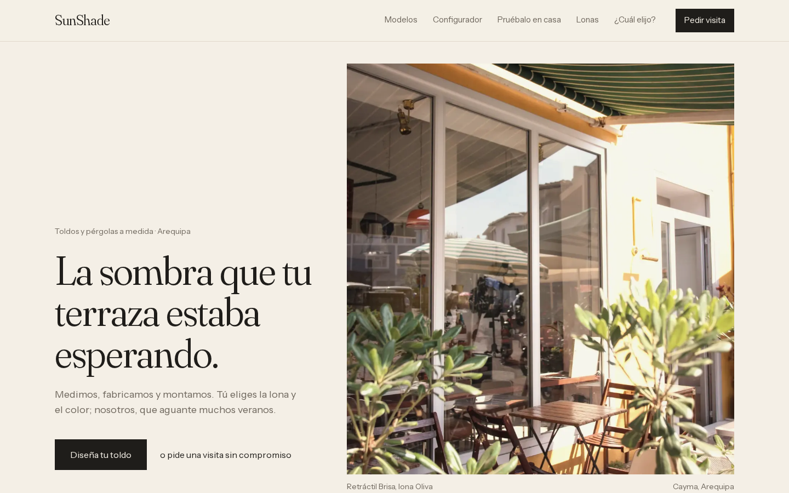

# Portafolio · Webs de solicitud de presupuesto

Monorepo de demostración con webs de **solicitud de visita/presupuesto** (no e‑commerce)
para fabricantes e instaladores de protección solar, puertas y ventanas.

- `apps/toldos` — **SunShade**, marca ficticia de toldos y pérgolas (B2C).
- `apps/cortinas` — *(fase 2)* reutilizará todo `packages/core`.
- `packages/core` — piezas compartidas: motor de precios y reglas, validaciones,
  esquema de base de datos, subida de archivos, autenticación, emails, PDF,
  CRUD genérico y componentes de UI (formularios, subida de fotos, panel admin,
  superposición en perspectiva).

Stack: Next.js 16 (App Router, TypeScript) · Tailwind CSS 4 · PostgreSQL + Drizzle ORM ·
Zod · pnpm workspaces · Vitest · Playwright (capturas / prueba E2E).



---

## Qué incluye SunShade

| Sección | Ruta | Notas |
|---|---|---|
| Inicio | `/` | Hero editorial, cifras, modelos, testimonios, proceso |
| Modelos | `/modelos` | Retráctil, cofre, vertical, pérgola + galería |
| Configurador | `/configurador` | Tipo, medidas con mín./máx., lona, color, accionamiento. Dibujo SVG y precio "desde" en vivo |
| Pruébalo en tu casa | `/pruebalo` | Subes una foto, arrastras 4 esquinas (perspectiva) y descargas la composición. Todo en el navegador |
| Asistente | `/asistente` | 3 preguntas → recomienda modelos |
| Muestrario | `/muestrario` | Lonas por colección, vista previa puesta |
| Solicitar visita | `/solicitar-visita` | Diseño guardado, fotos, distrito validado contra las zonas de servicio, fecha, contacto. Sin cuenta |
| Admin | `/admin` | Tablero de leads por estado + filtros, ficha con notas y fotos, calendario de visitas, PDF, CRUD de catálogo, reglas de precio y zonas |

Acceso demo al panel: **demo@demo.com / demo1234** (se muestra en la página de login).

---

## Arrancar en local

Requisitos: Node 20+, pnpm 10, PostgreSQL 14+ (local o un proyecto de Neon).

```bash
pnpm install

# 1) Variables de entorno
cp apps/toldos/.env.example apps/toldos/.env
#    Edita DATABASE_URL. Ejemplo con Postgres local:
#    createuser -P sunshade && createdb -O sunshade toldos

# 2) Crear tablas y cargar datos de ejemplo
pnpm db:push
pnpm db:seed

# 3) Desarrollo
pnpm dev            # http://localhost:3000
```

Otros comandos (desde la raíz):

```bash
pnpm test           # tests (precios, validaciones, perspectiva, calendario, asistente)
pnpm typecheck      # TypeScript en todos los paquetes
pnpm lint           # ESLint
pnpm build          # build de producción

# Capturas + recorrido E2E (con la app arrancada)
pnpm --filter toldos build && pnpm --filter toldos start &
BASE_URL=http://localhost:3000 pnpm --filter toldos screenshots   # -> /screenshots

pnpm --filter toldos images   # regenera public/img desde assets-src (tratamiento de color)
```

Sin `S3_BUCKET` las fotos se guardan en `apps/toldos/.data/uploads`. Sin `RESEND_API_KEY`
los emails se imprimen en la consola del servidor.

---

## Desplegar (todo en planes gratuitos)

Cada app es **un proyecto de Vercel** distinto apuntando al mismo repositorio.

### 1. Base de datos — Neon
1. Crea un proyecto en [neon.tech](https://neon.tech) (región Frankfurt o Ámsterdam).
2. Copia la *connection string* **pooled** (`...-pooler...neon.tech/...?sslmode=require`).
3. Desde tu máquina, crea las tablas y los datos demo:
   ```bash
   cd apps/toldos
   DATABASE_URL="postgres://...pooler.../neondb?sslmode=require" pnpm db:push
   DATABASE_URL="postgres://...pooler.../neondb?sslmode=require" pnpm db:seed
   ```

### 2. Fotos — Cloudflare R2
En Vercel el disco no es persistente, así que en producción **R2 es obligatorio** para las fotos.
1. Cloudflare → R2 → *Create bucket* (p. ej. `sunshade-uploads`). Puede ser privado:
   las fotos se sirven a través de `/api/files/...` solo a admins.
2. R2 → *Manage API tokens* → token con permiso *Object Read & Write* para ese bucket.
3. Apunta: Account ID, Access Key ID y Secret Access Key.

### 3. Emails — Resend (opcional)
1. Crea una cuenta en [resend.com](https://resend.com) y una API key.
2. Para enviar a cualquier destinatario hay que verificar un dominio; sin dominio,
   Resend solo envía a tu propio email (suficiente para la demo).

### 4. Vercel
1. *Add New → Project* → importa el repositorio.
2. **Root Directory:** `apps/toldos` (Vercel detecta Next.js y pnpm workspaces).
3. Variables de entorno:

   | Variable | Valor |
   |---|---|
   | `DATABASE_URL` | URL pooled de Neon |
   | `AUTH_SECRET` | `openssl rand -base64 32` |
   | `S3_BUCKET` | `sunshade-uploads` |
   | `S3_ENDPOINT` | `https://<ACCOUNT_ID>.r2.cloudflarestorage.com` |
   | `S3_REGION` | `auto` |
   | `S3_ACCESS_KEY_ID` / `S3_SECRET_ACCESS_KEY` | token de R2 |
   | `RESEND_API_KEY` | *(opcional)* |
   | `EMAIL_FROM` | *(opcional)* `SunShade <avisos@tudominio.com>` |
   | `NOTIFY_EMAIL` | *(opcional)* email que recibe los avisos de nuevos leads |

4. *Deploy*. Para la futura app de cortinas: otro proyecto con Root Directory `apps/cortinas`
   y su propia base de datos de Neon.

---

## Estructura

```
packages/core/src
├── pricing.ts          Motor de precios y reglas de medidas (puro, testeado)
├── validation.ts       Esquemas Zod: formulario, distritos/zonas, RUC, fechas
├── perspective.ts      Homografía: CSS matrix3d + deformación en canvas
├── db/schema.ts        Tablas (genéricas: sirven para toldos y cortinas)
├── db/client.ts        Conexión Postgres (local o Neon)
├── storage.ts          Archivos: disco local o S3/R2
├── auth.ts             bcrypt + sesión JWT en cookie
├── crud.ts             Fábrica de rutas REST para el CRUD del admin
├── email.ts · pdf.ts · leads.ts · calendar.ts
└── ui/                 Field, FileDropzone, AdminShell, CrudManager, PerspectiveOverlay

apps/toldos/src
├── app/(site)/         Web pública
├── app/admin/          Login + panel (layout protegido)
├── app/api/            leads, zonas, archivos, CRUD admin, PDF
├── components/         AwningPreview (SVG), Configurator, OverlayStudio, Wizard…
├── lib/                catálogo, sesión, textos, recomendación, campos del admin
└── proxy.ts            Protege /admin y /api/admin
```

### Para estudiar el código (orden sugerido)
1. `packages/core/src/pricing.ts` y su test — lógica pura, sin React.
2. `apps/toldos/src/components/Configurator.tsx` — estado en React y precio en vivo.
3. `apps/toldos/src/components/AwningPreview.tsx` — cómo se dibuja un SVG con datos.
4. `apps/toldos/src/app/api/leads/route.ts` — una API completa: validar, guardar, avisar.
5. `apps/toldos/src/app/admin/actions.ts` — Server Actions de Next.js.
6. `packages/core/src/ui/PerspectiveOverlay.tsx` + `perspective.ts` — la parte más "matemática".

### Cómo reutilizar `core` en `apps/cortinas`
- Copia la estructura de `apps/toldos` y cambia `content.ts`, la paleta en `globals.css`
  y el dibujo SVG (p. ej. `CurtainPreview`).
- Los `type` de `product_models` serán otros (`enrollable`, `plisada`…) y las reglas de
  precio y zonas se gestionan igual desde el panel.
- `CrudManager`, `FileDropzone`, `PerspectiveOverlay`, `buildPdf`, `createCrudHandlers`,
  `calculatePrice` y los esquemas Zod se usan tal cual.

---

## Limitaciones conocidas
- Los precios son orientativos y de ejemplo; el redondeo es a decenas.
- "Pruébalo en tu casa" es un ajuste manual de 4 esquinas (sin detección automática de
  la fachada). Las fotos HEIC se aceptan en el formulario, pero el navegador no puede
  previsualizarlas.
- El panel tiene un único rol (admin). No hay recuperación de contraseña ni gestión de usuarios.
- Sin migraciones versionadas: se usa `drizzle-kit push` (cómodo para una demo; en un
  proyecto real, `drizzle-kit generate` + `migrate`).
- Las zonas de servicio son distritos (Arequipa en la demo); se comparan por nombre, sin tildes.
- Precios en soles (S/), orientativos e IGV incluido.
- Algunas fotos son de terrazas de cafés; ver `CREDITS.md`.
